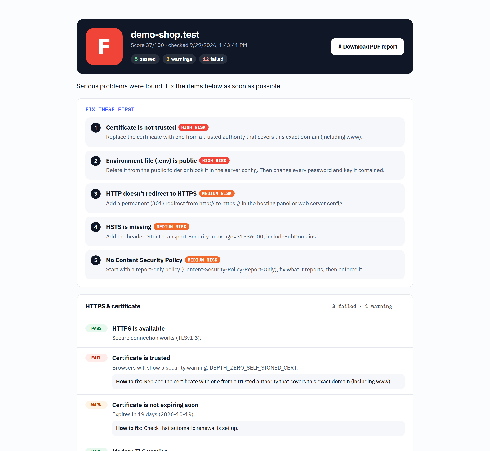
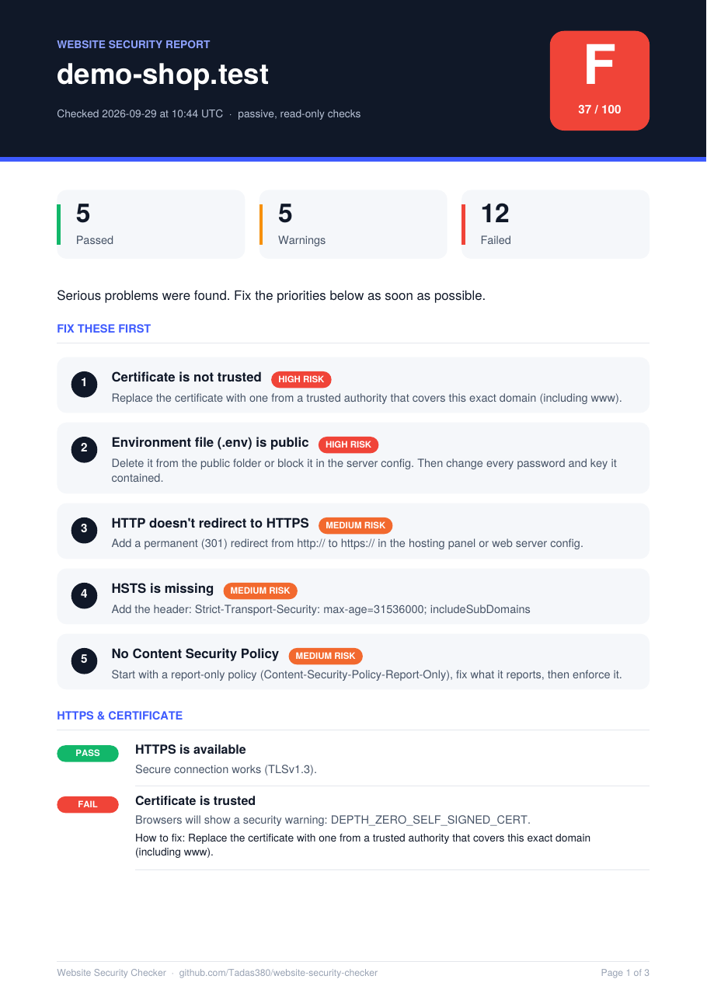

# Website Security Checker

[](https://github.com/Tadas380/website-security-checker/actions/workflows/test.yml)


A passive security scanner for websites. Enter a domain and within seconds you get an **A–F grade**, a list of what to **fix first** in plain language, and a **PDF report** a business owner can pass to their web developer.

It checks what attackers look at first: HTTPS and the certificate, security headers, publicly exposed files (`.git`, `.env`), email spoofing protection (SPF/DMARC), software version leaks and cookie flags.

**Live demo:** _add your Render link here_



---

## What it checks

| Area | Checks |
|---|---|
| **HTTPS & certificate** | HTTPS works · certificate is trusted · days until expiry · TLS version · HTTP → HTTPS redirect · HSTS |
| **Security headers** | Content-Security-Policy · clickjacking (X-Frame-Options / frame-ancestors) · X-Content-Type-Options · Referrer-Policy · Permissions-Policy |
| **Exposed files** | `/.git/HEAD` · `/.env` · `phpinfo.php` · `.DS_Store` (detected by content signature, so "soft 404" pages don't cause false alarms) |
| **Email spoofing** | SPF record and its `all` qualifier · DMARC policy (`none` / `quarantine` / `reject`). Sites on a platform's shared address (`*.onrender.com`, `*.vercel.app`, `*.github.io` …) aren't blamed for DNS they can't control. |
| **Information leakage** | `Server` / `X-Powered-By` versions · WordPress version vs. the latest release · `security.txt` |
| **Cookies** | `Secure`, `HttpOnly` and `SameSite` flags |

**Scoring.** Each check has a weight. A pass earns the full weight, a warning half, a failure nothing. Critical problems also **cap the grade**: one high-risk failure means at best a D, two mean F. An exposed `.env` file can never hide behind good headers.

## PDF report

The report is generated by a **small PDF writer I wrote from scratch** (`lib/pdf.js`, about 160 lines). It covers the PDF object model, the cross-reference table, zlib-compressed content streams, WinAnsi text encoding and exact word wrapping using the Helvetica font metrics. There are no PDF libraries.



## Security of the checker itself

A tool that fetches arbitrary URLs is a classic **SSRF** risk, where someone uses the server to reach internal networks. The checker is built with that in mind:

- **SSRF guard at connect time.** Every connection resolves DNS through `safeLookup`, which refuses loopback, private, link-local, CGNAT and cloud-metadata ranges (e.g. `169.254.169.254`) for IPv4 and IPv6. Because the check happens on the actual socket, DNS-rebinding tricks don't work.
- **Strict input.** Only domain names on ports 80/443. No IP literals, credentials in URLs or other protocols.
- **Passive only.** Normal `GET` requests, one TLS handshake and public DNS lookups. File contents are never stored or shown, only whether a signature matched.
- **Abuse limits.** Per-IP rate limiting, a global concurrency cap, timeouts and response-size limits.
- **Consent.** Users confirm they own the site or have permission.
- **It passes its own test.** Every response sends CSP, HSTS, X-Frame-Options, nosniff, Referrer-Policy and Permissions-Policy. The front-end inserts server data with `textContent` only, and there are no inline scripts.

## Project structure

```
server.js              HTTP API, rate limiting, security headers, static files
lib/net.js             SSRF-safe DNS lookup, HTTP/TLS probes, input validation
lib/checks.js          the checks (pure functions) + weighted scoring
lib/pdf.js             zero-dependency PDF writer
lib/report-pdf.js      report layout
lib/font-widths.js     Helvetica glyph metrics for text wrapping
public/                front-end (vanilla HTML/CSS/JS)
tests/                 node:test suite (22 tests)
```

## Run it

```bash
git clone https://github.com/Tadas380/website-security-checker.git
cd website-security-checker
npm start          # http://localhost:3000, no npm install needed
npm test
```

For local experiments against your own test servers, `ALLOW_PRIVATE_TARGETS=1 npm start` disables the SSRF guard. **Never set this in production.**

### Deploy

On any Node host, e.g. **Render** (free tier): create a Web Service from this repo with start command `node server.js`. No environment variables are required.

## API

| Method | Path | |
|---|---|---|
| `POST` | `/api/scan` | `{ "url": "example.lt", "consent": true }` → scan result with `id`, `grade`, `score`, `categories[]` |
| `GET` | `/api/report/:id.pdf` | PDF report (kept for 1 hour) |
| `GET` | `/api/health` | health check |

## Tests

`npm test` runs 22 tests with Node's built-in runner, and GitHub Actions runs them on Node 18, 20 and 22 for every push. They cover every check (including false-positive cases), the scoring caps, the SSRF guard, input validation, PDF structure (the test verifies every byte offset in the cross-reference table) and the HTTP API.

## Limitations

- It checks the homepage only, not every page.
- TLS 1.0/1.1 support is inferred from the negotiated protocol, not by forcing old versions.
- For SPF/DMARC it only strips a leading `www.` to find the main domain.
- It's a first-look scanner, not a penetration test. A good grade means common protections are in place, not that a site is secure.

---

Built by **Tadas Kaziunas** (Kaunas, Lithuania), graduate in Cybersecurity and Systems · [github.com/Tadas380](https://github.com/Tadas380) · MIT license
